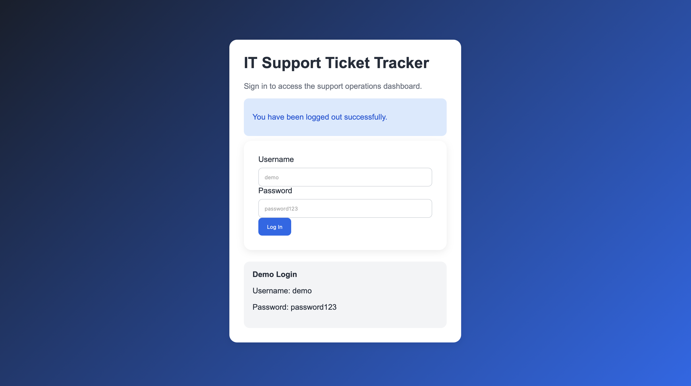
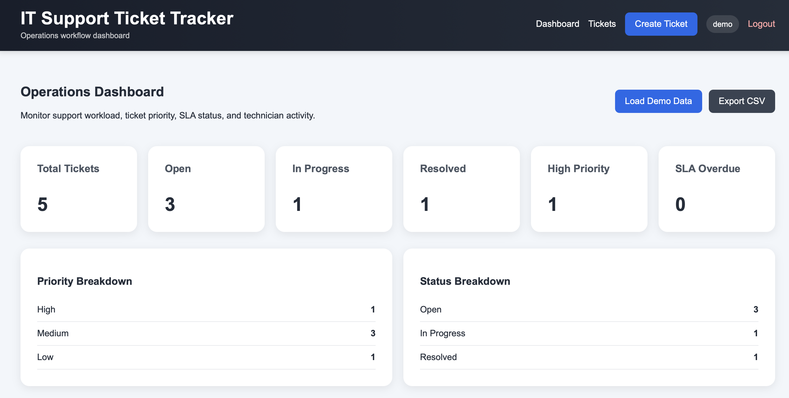
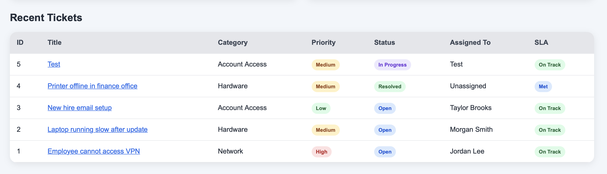
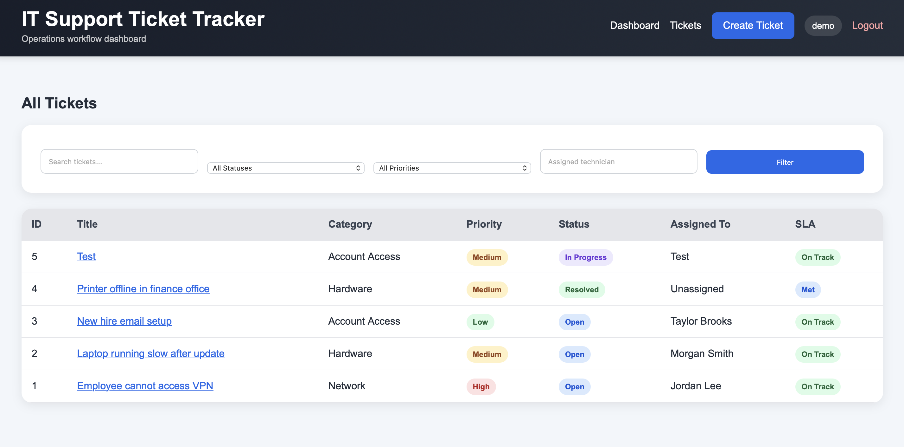
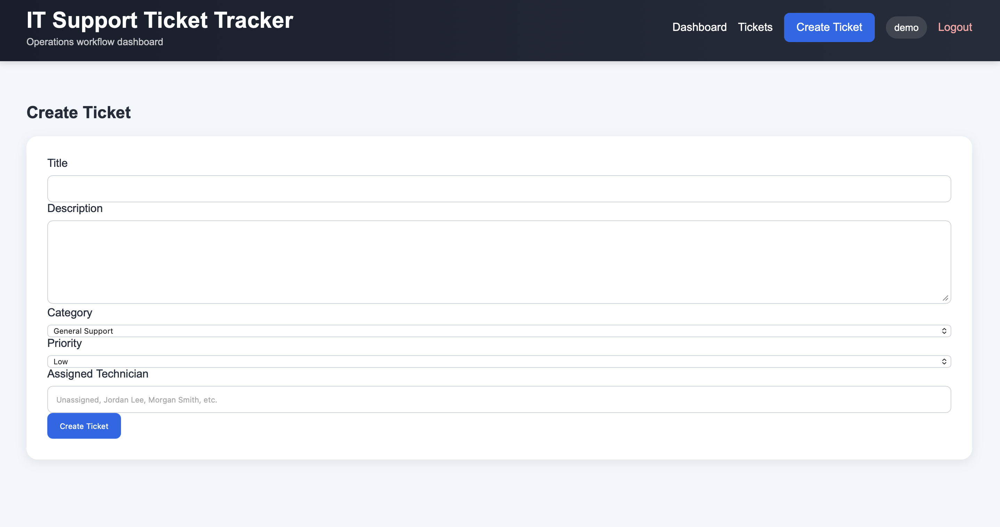
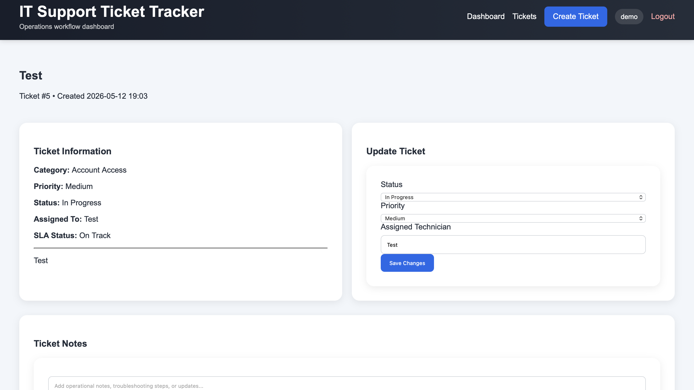
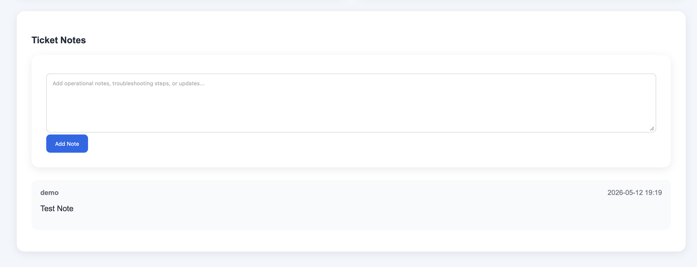
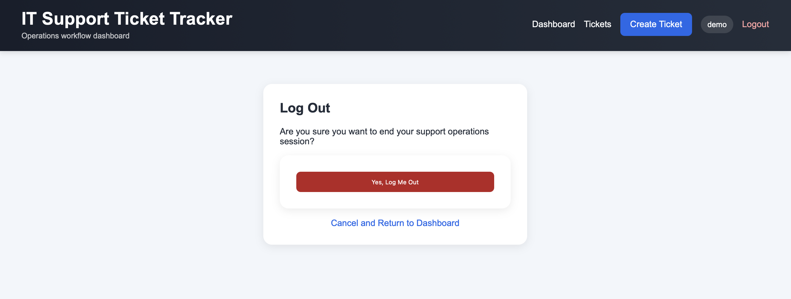

# IT Support Ticket Tracker

A recruiter-focused IT operations and support workflow platform built with Flask, Python, SQLite, SQLAlchemy, Chart.js analytics, and a custom HTML/CSS interface.

## Live Demo

[View the live project on Render](https://it-support-ticket-tracker.onrender.com/)

Demo credentials:

```text
Username: demo
Password: password123
```

## Project Overview

This application simulates the type of internal ticket management system used by IT support, technology operations, and business systems teams. The goal of the project is to demonstrate practical full-stack development, systems analysis, workflow design, dashboard reporting, and operational analytics in a way that connects directly to real entry-level technology roles.

Users can log in, create support tickets, assign technicians, update ticket status, add operational notes, monitor SLA status, filter ticket queues, export reports, and visualize operational data through dashboard analytics.

## Key Features

- Secure login and logout confirmation flow
- Operations dashboard with KPI metrics
- Chart.js analytics visualizations
- Ticket creation with category, priority, and technician assignment
- Ticket status updates for Open, In Progress, and Resolved workflows
- SLA tracking based on priority level
- Search and filtering by keyword, status, priority, and assigned technician
- Ticket detail pages with analyst notes/comments
- CSV export for operational reporting
- Demo data seeding for recruiter walkthroughs
- Responsive modern UI styling
- Docker and Render deployment support

## Screenshots

### Login Page


### Operations Dashboard


### Analytics Dashboard


### Ticket Queue


### Create Ticket


### Ticket Detail


### Ticket Notes and Status Updates


### Logout Confirmation


## Technologies Used

- Python
- Flask
- Flask-SQLAlchemy
- SQLite
- Gunicorn
- Chart.js
- Docker
- HTML
- CSS
- Jinja templates
- CSV reporting
- Werkzeug password hashing
- Render deployment

## Local Setup

Clone the repository:

```bash
git clone https://github.com/stantleff/it-support-ticket-tracker.git
cd it-support-ticket-tracker
```

Create and activate a virtual environment:

```bash
python -m venv .venv
source .venv/bin/activate
```

Install dependencies:

```bash
pip install -r requirements.txt
```

Run the application:

```bash
python app.py
```

Open the app in your browser:

```text
http://127.0.0.1:5000
```

Optional: after logging in, visit the route below to load demo tickets:

```text
http://127.0.0.1:5000/seed
```

## Docker Deployment

Build the Docker image:

```bash
docker build -t it-support-ticket-tracker .
```

Run the container:

```bash
docker run -p 10000:10000 it-support-ticket-tracker
```

Open in browser:

```text
http://localhost:10000
```

## Render Deployment

This project is deployed live on Render:

[https://it-support-ticket-tracker.onrender.com/](https://it-support-ticket-tracker.onrender.com/)

The repository includes a `render.yaml` configuration and uses Gunicorn with a WSGI entrypoint for production deployment.

## Recruiter Walkthrough

A suggested walkthrough for this project:

1. Open the live Render demo.
2. Log in using the demo account.
3. Review dashboard metrics such as open tickets, high-priority tickets, resolved tickets, and SLA overdue tickets.
4. Analyze the dashboard charts for ticket priority, technician workload, SLA compliance, and ticket status.
5. Create a new ticket and assign a priority, category, and technician.
6. Open the ticket detail page and update the status.
7. Add an analyst note to show the operational history workflow.
8. Use filters on the ticket queue to search by status, priority, or technician.
9. Export the CSV report to demonstrate reporting functionality.
10. Log out using the confirmation page.

## Career Relevance

This project is designed to align with roles such as:

- Systems Analyst
- Business Systems Analyst
- IT Support Analyst
- Technology Operations Analyst
- Project Coordinator
- Junior Project Manager
- Operations Technology Associate

The project demonstrates more than basic coding. It shows the ability to design a business-facing workflow application with database persistence, user authentication, dashboard metrics, operational reporting, data visualization, deployment configuration, and a clean end-user experience.

## Future Enhancements

- Dark mode toggle
- Role-based permissions
- Audit log history
- Advanced SLA reporting
- Real-time notifications
- PostgreSQL production database
- Email notifications
- REST API integration

## Author

Sawyer Tantleff
